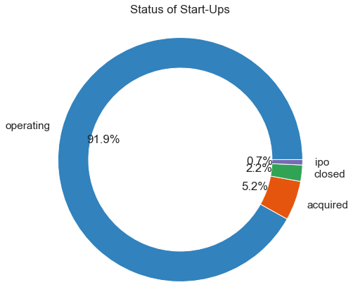
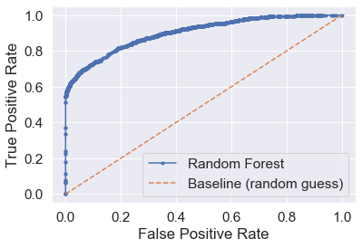

# A MACHINE LEARNING APPROACH FOR START-UP INVESTMENTS

                                                       

**Abstract**

In this project a machine learning approach which classifies startups into 2 classes (successful and unsuccessful) was implemented and explored. The dataset for the project was acquired from Crunchbase. It is comprised of  11 different tables containing information about startups, investors, relationships and founder’s background in the ecosystem, among many other information. Four tables were shortlisted and merged into one dataset. After data transformation and pre-processing however, a large amount of data had to be dropped as a result of data sparsity. The final dataset was made up of 61,716 instances of startups and 36 features. Feature scaling was also conducted which reduced the number of features to seven while keeping the same predictive power.

Five supervised machine learning algorithms were used on the data, these include: Decision Tree, Support Vector Machine, Random Forest, Naïve Bayes and Multilayer Perceptron. K-means Clustering was also applied in combination and was used to boost the performance.

All machine learning algorithms achieved  an accuracy score of above 90%. However, this can be attributed to the skewed distribution of classes present on the dataset. 

Recall was identified to be a more important performance metric, as a strategy that minimises false negatives (misclassifying any successful startup as unsuccessful) should be prioritised (cost of the missed opportunity is extremely high).

It was shown that the MLP model performed the best out of all the other models, achieving an accuracy of 98%, a precision of 95% and more surprisingly a recall of 91%.

It was concluded that although the MLP achieved a reasonable score for recall, it should not be deployed yet as the dataset used had some limitation, specifically its outdatedness and lack of completeness. The model, however, could be used by investors in the initial phase of screening startups and could potentially save them a significant amount of time; it could also help them avoid tedious work.

***Keywords**: startup, investment, machine learning, SVM, DT, RF, NB, MLP, Crunchbase, K-means Clustering*

# Literature Review

There are several different strategies that have been taken in developing an accurate method that predicts the success of early stage companies.  

One of the earliest examples in this field, published in 2003, showcases a rule-based expert system for predicting company acquisition [1]. Although the model achieves a success rate of 70%, the effectiveness of the work is very limited as a dataset of only 200 startups was considered.

Similarly, H. Littunen and H. Niittykangas analysed 200 companies based in Finland using a logistic regression. They looked at the founder’s background, motive and management style among other attributes [2]. Moreover, other work in the north-east of England studied the survival and failure of manufacturing startups by using log-logistic hazard models. It investigated the connection between the survival time of firms, they’re sizes and the macroeconomic conditions. However, this study too focused solely on 181 firms [3].

A common strategy used to predict the success or failure of a startup involves using a logistic regression, shown in the work conducted by R. N. Lussier and S. Pfeifer[4]. In this study, by reviewing 20 different previous works, 15 dependent variables were obtained. The work has also been broadened and modelled for different countries, including Chile, Croatia and the USA [5],[6] with varying outcomes. For example, in the USA only four out of the 15 variables were deemed to be statistically significant. Additionally, this study is also very limited as it considers a small sample size.

Work by R. Nahata, published in 2008, looked specifically into the venture capital investment performance and connected it to the reputation of the VC firm. It was shown that VC firms with a higher reputation are more likely to help they’re portfolio companies achieve successful exits [7].

Furthermore, S. Hoenen’s work used a linear regression model to investigate if patents increase VC investment for biotechnology companies in the United States [14]. The companies studied were incorporated between 1974 and 2011, and attributes that define the startups included the number of patents owned, investment funding received directly from VCs and regional information among other attributes.

Most work conducted, especially after the late 2000s, focuses more on data-driven machine learning models. This can be attributed the to the increase in the availability of data. While before, significant amount of effort was required to gather data on startups, companies such as Crunchbase have made it much more accessible, although they charge a significant amount for their services. 

A study by Yankov et al.  published in 2014, uses a questionnaire and the use of multiple machine learning methods to predict the success rate of Bulgarian startups. Decision trees were shown to be the most accurate and were able to extract important  startup success factors such as the founder’s background and the company’s competitive advantage.[8]

A study published in 2009 [9], investigated the merger and acquisition market in Japan and used an ensemble classifier to predict 600 different cases.  It was reported that the models achieved a global accuracy of 88% and a precision of around 40% when predicting an acquisition.

Furthermore, D. J. McKenzie and D. Sansone compared machine learning methods with domain experts in the field of startup investment. They conducted a business plan competition in Nigeria, which involved 2056 startups. The report shows that machine learning techniques achieved an accuracy of 63% in predicting successful startups while the domain experts achieved a 58% accuracy. This highlighted that startup investment prediction is a difficult task, and even human experts in the field struggle significantly in getting it right.[10]

A more advance approach conducted by Xiang et al. (2012) compares different ML classifier that have been trained to predict startup acquisition for companies started between 1970 and 2007 [11].

Some of the startup features used include finance sources, management team information and more interestingly news from TechCrunch, which is an American online publisher focusing on tech industry and trends. One major drawback they faced involved disregarding 20000 companies as a direct result of data sparsity in the dataset. They managed to keep 60000 startups described by 22 attributes. Furthermore, enriching the dataset using a corpus of over 38,000 news was not successful as only 5000 of the companies were present in the corpus. The study showed that Bayesian Networks performed better in comparison to both logistic regression and SVM. They achieved a precision which ranges between 60% to 79.8% from half of the categories. It was concluded that information gained from news outlets improved the overall results.

More sophisticated approaches which combine supervised (Support Vector Machines) and unsupervised learning (clustering)  to predict business models with higher growth and better chance of survival were also conducted  [12]. The study focused on startups in the USA and Germany. It achieved an accuracy of 83.6% when trying to predict survivability. However, it had major limitations as  it used a dataset comprised of around 181 businesses.

Furthermore, F. R. da Silva Ribeiro Bento proposes a machine learning approach to predict startup success (either a merger & acquisition or an IPO) [13]. The study used SVM, logistic regression and random forests on dataset acquired from Crunchbase, comprising of 80,000 startups from 5 states in the United States  (founded between 1985 and 2014) . A problem encountered in the study relates to the unbalanced classes within the dataset, only 16.8% of the startups in the whole dataset were labelled as successful. In order to tackle this problem, the author employs an oversampling strategy of the minority class. However, the impact of this oversampling is not considered in the evaluation of results. The precision achieved is reported to be 92%.

Lastly, work by A. Raghuvanshi, T. Balakrishnan and M. Balakrishnan propose a different approach by considering investor-company relationships. These relationships were represented in a bipartite graph with edges representing an investment made by an investor into a startup. The graph contains information about the startups such as location, industry, business model etc. Each edge is also labelled with the investment amount and funding round [15]. 

The network was then used to predict edges (investments) and their respective weights (the amount invested) using Supervised machine learning and Supervised Random Walks. The highest accuracy was achieved by a supervised machine learning model (Logistic regression 39.1%).

# Problem analysis and Design of choices

The main objective of this project will entail the use of machine learning algorithms to differentiate successful startups from unsuccessful ones. From the literature, one can conclude that the best data for this task is produced by companies such as Crunchbase, which are rich repositories of startup information. As a result, a dataset exported from Crunchbase will be used for the implementation.

Furthermore, previous approaches focused too much on acquisition or IPO to determine if a startup is successful or not.  As a result, a wider approach will be taken to define the success of a company.

The project will focus on the binary classification of startups, as differentiating between successful and unsuccessful startups is critical for any investment to be made. As a result, multiple  supervised classification algorithms will be used and compared to one another.

The five different machine learning models to be used include a Decision Tree, as from the literature a couple of studies found them to be better performing, but also for their explainability. Random forest will be the second algorithm, as it’s an ensemble method so it would be interesting to compare it with DT. Logistic Regression will be avoided as it had been used many times in previous studies, so its performance to solve similar problems is well known on. Furthermore, Support Vector Machines and Naïve Bayes will also be used, again as they have been shown in at least one previous study to perform well. Finally, a Multilayer Perceptron will also be implemented as previous studies have not explored its use in this setting.

As suggested by M. Böhm et al. [12] combining a supervised with an unsupervised machine learning model will lead to better improvements. As a result, K-means clustering will also be combined with the models described above in order to boost their performance.

Moreover, a comprehensive feature description of a startup will be used. This will include information not only about the startup, but also about the management team and their background. 

Furthermore, the models will not be trained on specific regions or markets, such as shown in previous work. On the other hand, the dataset will include all region and markets that are available in order to increase its size and be more representative of any startup, regardless of where it is based. 

A thorough exploratory data analysis (EDA) will also be performed before any training, in order to understand our dataset better,  but also in order to gain a much deeper insight into startup world.

Additionally, feature  selection will also be implemented as this will not only be more efficient, but it will also highlight the features with the most power capable of predicting successful startups.

Hyperparameter tuning will also be conducted for the supervised machine learning algorithms, in order to boost their performance. These models will then be evaluated using different performance metrics such as ROC, accuracy, precision, recall  and F1 score. Finally, they will be compared to one another.

## Dataset

The dataset used for this project was provided by Kaggle [16], although it was originally sourced from Crunchbase. Crunchbase is a platform for finding business information about private and public companies. The information provided ranges from company funding information, to industry trends and data on individuals in leadership positions [17].

The dataset provides a glimpse of the startup world back in 2013. It was chosen as it was the most complete startup investment dataset available for free. Up to date information about startup companies are available from Crunchbase and its competitors such as CB Insights, however they are provided at a significant cost.

The dataset is 372.26 MB large and contains diverse information about the startup ecosystem divided into 11 tables. The tables are linked to one another using unique IDs. 

Each table gives specific information about the startups, investments, and the people in the space. The headings of the 11 different tables are as given below:

- acquisitions.csv
- degrees.csv
- funding\_rounds.csv
- funds.csv
- investments.csv
- ipos.csv
- milestones.csv
- objects.csv
- offices.csv
- people.csv
- relationships.csv

The information deemed of value was extracted from 4 shortlisted tables and merged into one main dataframe. The 4 shortlisted tables include Objects.csv, degrees.csv, relationships.csv and funding rounds.csv. These were chosen as the data within them contains information not only about the startups but also about the founders and their backgrounds, as a result, a more holistic approach might result in a better outcome.

The merged dataset with the addition of newly created fields, and after pre-processing consisted of 36 features and 61716 instances. The full description of the features is given below.

|**Feature**|`	`**Description**|
| :- | :- |
|**entity\_id**|Assigned unique id|
|**normalized\_name**|Name of the startup|
|**status**|
Status of the startup 

(operating, closed, acquired or Ipo)
|
|**category\_code**|The market category the startup belongs to|
|**closed\_at**|The date a startup was closed|
|**country\_code**|The country where the startup is registered|
|**State\_code**|The state where the startup is registered|
|**region**|The region where the startup is registered|
|**city**|The city where the startup is registered|
|**description**|Short description of the startup|
|**tag\_list**|Tag list attributed to the startup|
|**first\_funding\_at**|The first funding date|
|**last\_funding\_at**|The last funding date|
|**funding\_rounds**|The number of funding rounds|
|**funding\_total\_usd**|The total amount of funding raised|
|**first\_milestone\_at**|The first milestone date|
|**last\_milestone\_at**|The last milestone date|
|**milestones**|The number of milestones|
|**relationships**|The number of relationships the company has in   the startup ecosystem|
|**title**|Title of the person related to the startup|
|**degree\_type**|Degree type undertaken by the founder, co-founder or CEO|
|**subject**|Subject undertaken by the founder, co-founder or CEO|
|**institution**|Institution attended by the founder, co-founder  or CEO|
|**graduated\_at**|The date the founder, co-founder or CEO graduated|
|**angel**|The total amount of money raised in seed stage|
|**seed**|The total amount of money raised in seed stage|
|**grant**|The total amount of money received as grant|
|**crowd\_equity**|The total amount of money raised via crowd equity |
|**series\_a**|The total amount of money raised in series a|
|**series\_b**|The total amount of money raised in series b|
|**series\_c**|The total amount of money raised in series c|
|**series\_d**|The total amount of money raised in series d|
|**series\_e**|The total amount of money raised in series e|
|**series\_f**|The total amount of money raised in series f|
|**series\_g**|The total amount of money raised in series g|
|**debt\_round**|The total amount of money raised via debt|
|**private\_equity**|The total amount of money raised via private equity|
|**convertible**|The total amount of money raised via convertibles|
|**crowd**|
The total amount raised from the crowd without 

giving up equity
|
|**post\_ipo\_equity**|Total amount raised post Ipo in equity|
|**secondary\_market**|Total amount raised in the secondary market|
|**post\_ipo\_debt**|Total amount raised post Ipo in debt|
|**unattributed**|Total amount raised from unknown sources|
|**twitter\_account**|1 if the startup has a twitter account, 0 if not|
|**satus\_cat**|0=acquired 1=closed 2=ipo 3=operating|
|**startup\_age**|The age of the startup|
|**labels**|1= Successful, 0=Unsuccessful|
# Implementation

## Programming language of choice

Python was chosen as the main programming language to conduct the analysis and build the machine learning models. Python has been gaining a lot of popularity in the last few years as  a direct result of its available resources and its functionality. Python has a great library ecosystem; it includes libraries such as Pandas, Numpy and Scikit-learn which allows you to access, manipulate and transform data. This makes it very efficient, as there is a large amount of data processing involved in any machine learning project. On top of that, it also comes with a good amount of data visualisation tools, allowing for greater data comprehension, presentation and reporting.
## Data gathering, merging and creation

In machine learning the use of data that is relevant to the problem domain is extremely important.

As a result, each of the 11 different tables were carefully examined and analysed in order to accumulate a comprehensive  amount of data that is directly relevant to the companies. For this project, instead of just focusing on data relating to the companies,  data relating to the founders that created those companies, was also targeted. This would provide a  holistic view and description of the company. This is done with the assumption that there must be a direct link between the performance of a company and the people that run the business (Founders, Co-founders, CEOs).

After examining all the different tables, four tables were shortlisted as the ones with the most relevant information. These include :

- ***Objects.csv*** – which mainly contains information about the companies, such as its founding date, its name , its status etc. However, it also includes information about the investment firms and investors (people) in the space.
- ***Funding\_rounds.csv*** –  which mainly contains information about the funding in the space, such as the type of funding companies received and the amount they raised in each funding.
- ***Relationship.csv*** –  which contains information about the people in the space, the position that they hold and the links that they have to investment firms and companies.
- ***Degrees.csv*** –  which contains information about the people in the space, the type of degree that they took and the institution they attended.

First, *Objectdf.csv* was analysed and only instances that relate to the companies were kept (i.e. entity\_type = company). Then, features which weren’t relevant,  or only relevant to the other entity types were dropped from the data (17 in total). After that, relationshipdf.csv was analysed and in the same way irrelevant features were dropped from the dataset. Furthermore, past relationships were ignored, and only current relationships were considered. Additionally, since the information of interest is mainly the management team in a company, only instances for the Founders, Co-founders or CEOs were kept.

Subsequently, degreesdf.csv was analysed and irrelevant features such as the date the instance was created or updated were dropped. Degreesdf.csv was then merged with relationshipdf.csv as they shared a common unique id feature, and a new dataset called *rel\_deg\_df* was formed. This new dataset was then also merged with Objects.csv, through the relationship unique id feature. All instances in Object.csv which didn’t have a corresponding value were kept (i.e. ‘*left join’* was used) and this new dataset was renamed *startupdf.* 

Lastly, funding\_round.csv was analysed. For each stage of funding a new feature was then created, and the corresponding amount raised was returned. As a result, 19 different features were created and added to the dataset, relating to the 19 different funding types/stages available. Furthermore, irrelevant features from funding\_round.csv were then dropped, and the dataset was then merged with *startupdf*. Finally, in order to have one instance appearing just once, the dataset was grouped using the id feature, and the features were aggregated. This final dataframe was then renamed *startupnewdf*.

## Adding/changing features

Features that were added/changed in startupnewdf include:

- ***Twitter\_account*** : which returns 0 if the company has no twitter account or 1 if it has one. It does this by checking the twitter\_username feature.

- ***Status\_cat***: which uses the status feature to return numerical categorical values for each status (*0=acquired, 1=closed,  2=ipo, 3=operating*).

- Features including:  ***'closed\_at', 'first\_funding\_at', 'last\_funding\_at', 'first\_milestone\_at', 'last\_milestone\_at',***  and ***'graduated\_at'***. 

These were time dependent features which returned values in terms of a specific date. These were not that useful in the format that they were, as a result, they were first changed from an object type to a datetime data type. Subsequently, each feature in consideration was subtracted from the date the company was founded (founded\_at), in order to obtain the time difference (timedelta) between the two dates in months. These were then returned under the corresponding feature and turned to an int datatype. This information is much more useful, as it informs us the length (in months) a startup took to achieve the corresponding feature described. In terms of the ‘graduated\_at’ feature, it lets us know the time difference between the graduation of the founder/Co-founder/CEO and the startup founding date.

- ***Startup\_age***:  An arbitrary date in 2014 was chosen as the ‘current date’ , as the dataset relates to startups in 2013. Startup age was then calculated (in years) by taking away the current date from the startup founding date.  Choosing the actual current date would distort the results as the dataset has not been updated. 

- ***Labels:*** In order to train the supervised classification ML models a labelled feature that distinguished between the successful and unsuccessful startups is required. The definition of successful was given as any startups which was operating and has raised funding at series b or beyond, or a startup that had gone through an Ipo, otherwise a startup was also successful if it  has been acquired. All other startups that fall outside these criteria were considered to be unsuccessful. The successful startups were given a value of 1 while the unsuccessful ones were given a value of 0. As a result, it is now possible to train the ML models based on these binary class values.

## Exploratory Data Analysis (EDA)

In order to understand the data more comprehensively and get better insights, an exploratory data analysis (EDA) was conducted.

In this section the data was investigated more thoroughly using both analysis and visualisation.

Things that were investigated and analysed include:

- The distribution of successful vs unsuccessful startups, in order to understand how biased, the dataset is.
- The distribution of startup founding year, the top 10 youngest and oldest startups and startup age distribution. This would help us understand how far back the dataset goes to and how much it could represent modern day startups.
- The distribution of startup closure in months, to understand the average time it takes for a startup to cease becoming operational.
- The distribution of startup founded after the year 1980 (when the first technology startups started to emerge).
- The distribution of countries startups were founded at, to highlight if certain regions had more concentration than others.
- Top 20 countries startups were founded at, to highlight the most dominant regions. 
- Top 20 countries startups were founded at after 2010, to check if there has been any shift in the last few years (which is more relevant).
- Top 10 Subjects undertaken by startup Founders, Co-founders or CEOs to understand these individual’s backgrounds.
- Top 5 degree types undertaken by startup Founders, Co-founders or CEOs to understand these individual’s backgrounds.
- Top 10 Institutions attended by startup Founders, Co-founders or CEOs to understand these individual’s backgrounds and to understand where talent is concentrated.
- Distribution of startups with a twitter account, to understand the proportion of startups engaging in social media.
- Distribution of the status of the startups in the dataset, to check the breakdown of the startups represented by the dataset.
- Distribution of  the status of startups in top 5 countries,  to check the breakdown of the startups represented by the dataset.
- Top markets categories with the greatest number of occurrences, to understand which markets are dominant.
- Distribution of top 10 market categories in the top four countries, to understand which markets are dominant in which regions.
- Market categories where most start-ups closed. Top markets that have 50+ startups in a specific market category were chosen to analyse. Highlights markets where the failure rate is high.
- Markets where the least number of start-ups closed. Highlights markets where the failure rate is low.
- Market categories where the greatest number of start-ups were acquired. Highlights markets where the likelihood of acquisition is high.
- Total proportion of funding allocated to the top 10% of startups. Highlights funding distribution.
- Total funding for each of the top 10 startups. Highlights the distribution of funding between the top 10 startups.
- Status vs funding rounds break-down. Highlights the break-down of funding rounds against the different possible startup statuses.
- Words in the startup tag list. Analysing them highlights the words used the most to describe the startups in the dataset.

After conducting the EDA, a much better comprehension of the dataset and its representation is achieved.
## Missing Values

Missing values for each feature were analysed and were either filled with zeros or a mean value. In other cases,  they were dropped when necessary. 

## Labelling categorical features

Most ML algorithms perform better when working with numerical inputs. As a result, categorical features including 'category\_code', 'country\_code', and 'city' were transformed into numeric type. This was done using  *category\_encoders*, which is a set of scikit-learn-style transformers used to encode categorical variables into numeric type. 

However, it is worth mentioning that this is not the optimal solution, as ML algorithms will assume that two nearby values are more similar than two far away ones. This of course is not the case with the categorical features being transformed in our dataset.

Another way to solve this would be to one-hot encode each category,  although this would also cause problems as it would result in a very large number of input features. This would have adverse effects on training time and could also degrade the performance. 

Alternatively, *representation learning* could also be used. In this case, each category can be replaced with a learnable, low-dimensional vector (embedding). The representation of each category would be learned during training [18].

## Feature scaling

Feature scaling is an important step that must be taken before applying any machine learning model. In most real-world cases, input numerical data will have very different scales from one another, and almost all ML models perform poorly if trained on unscaled data. 

There are generally two ways to perform feature scaling. These include MinMax scaling (normalisation) and Standardization. Minmax scaling involves shifting and rescaling values so that they fall between 0 and 1. This is done by subtracting the min value and dividing by the max take away the min. In Standardization on the other hand, the mean value is subtracted first and then divided by the standard deviation so that the resulting distribution has unit variance. This also means standardised values always have a mean of zero. Standardisation  does not bound values to a specific range ( not optimal as neural networks for example expect an input value ranging from zero to one), however, it is also less affected by outliers [18].

The data in our dataset is also unscaled. As a result, feature scaling was conducted on all the attributes on our dataset except the target feature, as it is not required (no need on binary values of 1 and 0). This was done by using Scikit-learn’s transformer called StandardScaler.

## Feature selection

Feature selection involves using certain algorithms to select features in the training data, that are most relevant in predicting the target variable. This reduces the number of features that must be used in training while also keeping the same predictive power.  Reduced number of features results in faster training times and fewer computational resources being taken up.

Recursive Feature Elimination (RFE) is a common feature selection method. It involves searching for the subset of optimal features by starting with all features and effectively removing least relevant features until a specified of number of features remains. This is done by fitting a specified ML model in the core of the model, which ranks features by importance and keeping the most important features only. This process is repeated iteratively until the specified number of features is achieved.

The two main configuration options that are inputted into RFE include the algorithm of choice and the number of features required. However, its performance is not strongly dependent on these hyperparameters being configured well [19].

Scikit-learn’s library was used for the implementation of RFE.

For our dataset, first an RFE using a Random Forest classifier model at its core, and a selection of 15 features was implemented.  However, it is usually recommended to use a different ml model than the one being used to train the dataset. As a result,  a GradientBoost algorithm was then chosen as an alternative. The advantage of using gradient boosting is that after the construction of the boosted trees, it becomes relatively easy to obtain importance scores for each feature [20]. Furthermore, instead of randomly specifying the number of features, the model was made to run iteratively across all possible number of features, and the one giving the highest score was then selected.

## ML Models

The dataset was first split using an 80:20 ratio, between the training and the testing data. Most of the data was kept for training as almost all ML algorithms train better when more data is applied.

Since the problem is a classification problem, five of the main supervised (classification) machine learning algorithms were chosen and implemented.

These include Support Vector Machine (SVM), Decision Tree (DT), Random Forest (RF), Naïve Bayes (NB) and Multilayer perceptron (MPL).

For each model, hyperparameter tuning was conducted in order to increase their respective performance. 

Since it is not known what values hyperparameters should have, one could fiddle with the values manually until a satisfactory result is obtained. However, this would be very inefficient as the values to explore are vast. The same task can be automated using Scikit-learn’s GridSearchCV, by specifying the hyperparameters and the different values to try out. GridSearchCV  would then use cross-validation to evaluate all possible combinations of hyperparameter values.

However, GridSearchCV can also be computationally expensive when the hyperparameter search space is vast. As a result, RandomizedSearchCV can be used as an alternative. RandomizedSearchCV works in a similar way as GridSearchCV, however, instead of trying all possible arrangements, at every iteration, it assesses a given number of random combinations by selecting a random value for each hyperparameter.

For our dataset RandomizedSearchCV was used to tune the models.  Scikit-learn’s RandomizedSearchCV was used for implementation.  

The models were evaluated using performance metrics including accuracy, precision, recall, confusion matrix and ROC curves.

## Comparison between the different models using cross-validation 

To compare the performance of the different models a 10-fold cross validation was used. This means that our dataset was split into 10 parts, with the training being done on 9 of them while 1 is left for the testing. This process is then repeated for all combinations of train-test splits in order to provide a more accurate estimation of the accuracy.

Stratified cross-validation is used to ensure that each split of the dataset will aim to have the same distribution of example by class, as they exist in the whole training dataset.

A plot is then created of the model evaluation results, and the spread and the mean accuracy of each model were compared. Since each algorithm was evaluated 10 times through 10-fold-cross validation, a box and whisker plot for each distribution was plotted. This was used to compare  the different distributions of the models.

Scikit-learn’s StratifiedKFold and cross\_val\_score was used for the implementation.

## Clustering

In the last section, the use of K-means clustering, was also explored. K-means clustering is an unsupervised algorithm, as a result the target feature was first dropped before applying the algorithm. 

Out of curiosity, initially K-means clustering with the number of cluster equal to 2 (corresponding to the successful and unsuccessful groups of startups) was run. This was done in order to investigate how accurately it would evaluate the two different clusters in comparison to the classifier models. This was then compared to the actual labels of the startups.

A better use case for K-means clustering was to find the optimal clusters for our dataset using the elbow method. 

Once the optimal number of clusters was found, the labels representing the clusters were then fed back into the original dataset as a new feature.

The ML classifier algorithm with the highest predictive accuracy was then retrained using this new enriched data in order to boost its performance even higher.

# RESULTS

## Exploratory  data analysis

*Figure* 1 Distribution of Successful vs Unsuccessful Startups

*Figure* 2 Startup age distribution in years

*Figure* 3 Startup closure times in months

*Figure* 4 Startup founded year distribution

From figure 4, it can be seen that startup creation began to increase significantly in the late 1990s (when the first internet companies started to emerge) . It flattened in the early 2000s ( as a result of the dotcom bust) for a short period of time, before it reached all-time highs in the late 2000s.

*Figure* 5 Startup founding year distribution after the year of 1980

Startup creation can be seen really taking off after 1980, when the first technology companies  came into the scene.

*Table* 1 Top 20 countries represented in the dataset

|**Country**|**count**|
| :- | :- |
|USA|38625|
|GBR|5365|
|IND|3105|
|CAN|2790|
|DEU|1457|
|FRA|1321|
|AUS|1076|
|ESP|912|
|ISR|838|
|NLD|688|
|IRL|522|
|SWE|500|
|CHN|498|
|ITA|491|
|BRA|474|
|FIN|428|
|CHE|396|
|SGP|392|
|RUS|372|
|JPN|352|

*Figure* 6 Top 10 subjects undertaken by startup founders/co-founders/CEOs

*Figure* 7 Top 5 degrees types undertaken by startup founders/co-founders/CEOs

*Figure* 8 Top 10 institutions attended by startup founders/co-founders/CEOs

*Figure* 9 Distribution of startups with a twitter account in the dataset

### Startup status

*Figure* 10 Status of startups in the dataset

Before Crunchbase failing startups were not recorded, as a result a survival bias will exist. There is an over-representation of companies created before Crunchbase came into the scene. In reality, the number of failed companies outnumbers the number of operating companies significantly. 

*Figure* 11 Status of startups in the top-5 countries

### Market Category

*Figure* 12 Top market categories of startups

Software is the most dominant market by far. Top 5 market categories are all internet based (with exception to ‘Other’).

*Figure* 13 Top market categories in the top 4 countries

Software and internet-based categories are prevalent in all four countries.

Table 2 Market categories where most start-ups closed

||**Market categories where most start-ups closed**|||
|:-|:-:|:-:|:-:|
|**category\_code**|**status**|**prop**|**quantity**|
|||||
|**messaging**|closed|0.085106|20|
|**semiconductor**|closed|0.050710|25|
|**social**|closed|0.045596|44|
|**web**|closed|0.040387|492|
|**photo\_video**|closed|0.039216|12|
|**games\_video**|closed|0.034209|164|
|**cleantech**|closed|0.032759|38|
|**sports**|closed|0.028470|8|
|**network\_hosting**|closed|0.028123|52|
|**mobile**|closed|0.027610|142|

Table 3 Markets where the least number of start-ups closed

||**Markets where the least number of start-ups closed**|||
|:-|:-:|:-:|:-:|
|**category\_code**|**status**|**prop**|**quantity**|
|||||
|**legal**|closed|0.003597|2|
|**health**|closed|0.004614|4|
|**education**|closed|0.004757|9|
|**consulting**|closed|0.006748|26|
|**manufacturing**|closed|0.008043|3|
|**transportation**|closed|0.009569|2|
|**real\_estate**|closed|0.009646|3|
|**other**|closed|0.010716|87|
|**design**|closed|0.010929|2|
|**analytics**|closed|0.011737|10|

Table 4 Market categories where the greatest number of start-ups were acquired

||Market categories where the greatest number of start-ups were acquired|||
|:-|:-:|:-:|:-:|
|**category\_code**|**status**|**prop**|**quantity**|
|||||
|**semiconductor**|acquired|0.215010|106|
|**security**|acquired|0.101754|87|
|**biotech**|acquired|0.094805|250|
|**messaging**|acquired|0.080851|19|
|**enterprise**|acquired|0.078207|267|
|**network\_hosting**|acquired|0.069767|129|
|**software**|acquired|0.068577|991|
|**mobile**|acquired|0.057748|297|
|**hardware**|acquired|0.056402|111|
|**cleantech**|acquired|0.055172|64|

### Funding distribution

Figure 14 Total funding allocated to the top 10% of startups

*Table* 5 Total funding (top 10 startups)

*Table*  6 Status vs funding round break-down

*Figure* 15 Status vs funding round plot

*Figure* 16 Word cloud using the words in the startup tag list column

The most prevalent words are all associated to internet-based businesses.
### Missing values and correlation matrix

*Figure* 17 Missing values (yellow) on the dataset

*Figure* 18 Correlation matrix heatmap

There is a strong inverse correlation between status\_cat and labels. This makes sense as the satus\_cat feature was one of the attributes used in making the labels feature.

## ML model results

### Feature selection
The seven most important features picked by RFE:

[*'closed\_at',  'funding\_total\_usd',  'relationships',  'series\_b',  'series\_c',  'series\_d',  'startup\_age'*]

### SVM model

SVM accuracy: 94.11% (+/- 1.76%)

SVM Classification report:

`              `precision    recall  f1-score   support

`           `0       0.94      1.00      0.97     10762

`           `1       0.97      0.56      0.71      1582

`    `accuracy                           0.94     12344

`   `macro avg       0.95      0.78      0.84     12344

weighted avg       0.94      0.94      0.93     12344

Baseline (random guess): ROC AUC=0.500

SVM: ROC AUC=0.844

Confusion Matrix of train data:  [[42978    16]

`                                 `[ 2794  3584]]

*Figure*  19 SVM ROC curve

### Decision Tree model

Decision Tree accuracy: 94.11% (+/- 1.76%)

Decision Tree Classification report:

`              `precision    recall  f1-score   support

`           `0       0.93      1.00      0.97     10762

`           `1       0.99      0.52      0.68      1582

`    `accuracy                           0.94     12344

`   `macro avg       0.96      0.76      0.82     12344

weighted avg       0.94      0.94      0.93     12344

Baseline (random guess): ROC AUC=0.500

Decision Tree: ROC AUC=0.845

Confusion Matrix of train data:  [[42964    30]

`                                 `[ 3098  3280]]

*Figure* 20 DT ROC curve

### Random Forest model

Random Forest accuracy: 94.11% (+/- 1.76%)

Random Forest Classification report:

`              `precision    recall  f1-score   support

`           `0       0.94      1.00      0.97     10762

`           `1       1.00      0.55      0.71      1582

`    `accuracy                           0.94     12344

`   `macro avg       0.97      0.77      0.84     12344

weighted avg       0.95      0.94      0.93     12344

Baseline (random guess): ROC AUC=0.500

Random Forest: ROC AUC=0.902

Confusion Matrix of train data:  [[42988     6]

`                                 `[ 2917  3461]]

*Figure* 21 RF ROC curve

### Naïve Bayes model

Naive Bayes accuracy: 94.11% (+/- 1.76%)

Naive Bayes Classification report:

`              `precision    recall  f1-score   support

`           `0       0.93      0.99      0.96     10762

`           `1       0.89      0.52      0.65      1582

`    `accuracy                           0.93     12344

`   `macro avg       0.91      0.75      0.81     12344

weighted avg       0.93      0.93      0.92     12344

Baseline (random guess): ROC AUC=0.500

Naive Bayes: ROC AUC=0.882

Confusion Matrix of train data:  [[42586   408]

`                                 `[ 3155  3223]]

*Figure* 22 NB ROC curve

### MLP model

MLP accuracy: 94.11% (+/- 1.76%)

MLP Classification report:

`              `precision    recall  f1-score   support

`           `0       0.94      1.00      0.97     10762

`           `1       0.96      0.58      0.72      1582

`    `accuracy                           0.94     12344

`   `macro avg       0.95      0.79      0.84     12344

weighted avg       0.94      0.94      0.94     12344

Baseline (random guess): ROC AUC=0.500

MLP: ROC AUC=0.904

Confusion Matrix of train data:  [[42828   166]

`                                 `[ 2722  3656]]

*Figure* 23 MLP ROC curve

### Comparison between the models

*Figure* 24 Comparison of the different models

### K-Means Clustering
Using the elbow method, the number of clusters k, was chosen to be 30.

*Figure*  25 Cluster number vs SSE
### MLP + K-Means clustering

`               `precision    recall  f1-score   support

`           `0       0.99      0.99      0.99     10762

`           `1       0.95      0.91      0.93      1582

`    `accuracy                           0.98     12344

`   `macro avg       0.97      0.95      0.96     12344

weighted avg       0.98      0.98      0.98     12344

Confusion Matrix of train data:  [[42961    33]

`                                 `[  233  6145]]

# Evaluation of results

It can be seen from the results above that all five machine learning models have similar results in terms of accuracy. They all had a predictive accuracy above 90% which seems impressive from a first glance. The MLP was the highest performing model with an accuracy of 94.25% while Naïve Bayes was the least accurate, although not that far away with 93%. 

This is quite understandable as MLP usually performs quite well when trained on a large amount of data. The results of the Naïve Bayes model could’ve also been expected as one major drawback of the algorithm is the assumption that all features are independent from one another. This is clearly not the case for our dataset, as can be seen from the correlation matrix heatmap. Another observation that is also reasonable, is that the Decision Tree model has been outperformed by the Random forest model. This makes sense, as ensemble methods will often perform better than the best individual model.

Accuracy alone might not be the best metric to evaluate. Since only 10% of our dataset was made of the successful startups (labels of 1), classifying a startup to be unsuccessful (label 0) all the time, would result in a correct outcome in about 90% of the time. This highlights the drawback of  measuring accuracy as a single metric, especially when dealing with a dataset that is not evenly distributed between the two classes.

As a result, a confusion matrix can give us a deeper insight into how good the model really is.

Looking at the confusion matrix generated for each model, one can see that almost all of them did a decent job at classifying unsuccessful startups (majority case). However, we observe a different case when it comes to predicting successful startups (label 1s). 

- In the SVM model 2794 actual successful startups were misclassified as being unsuccessful (false negatives), while only 16 unsuccessful startups were classified as being successful (false positives). 
- In the DT model 3098 actual successful startups were misclassified as being unsuccessful (false negatives), while only 30 unsuccessful startups were classified as being successful (false positives). 
- In the RF model 2917 actual successful startups were misclassified as being unsuccessful (false negatives), while only 12 unsuccessful startups were classified as being successful (false positives). 
- In the NB model 3155 actual successful startups were misclassified as being unsuccessful (false negatives), while 408 unsuccessful startups were classified as being successful (false positives). 
- In the MLP model 2722 actual successful startups were misclassified as being unsuccessful (false negatives), while only 166 unsuccessful startups were classified as being successful (false positives). 

Comparing all the values it can be concluded that, when taking into account the number of *true* *positives* (successful startups expected, and predicted correctly by the model), the MLP model performs the best followed by SVM, RF, DT and finally NB (which predicted only about half of all the successful companies correctly).

The ROC curve for the models, which plots  the *true positive rate* (recall) against the *false positive rate* (FPR) was also evaluated. MLP gives the highest ROC AUC score while SVM gives the lowest out of all the models. Looking at the ROC curves generally, one can be persuaded to think that the classifiers are performing well. Nonetheless, again this is mostly because there are few label 1s compared to the 0 labels. 

In the ROC curve, it is optimal when the Euclidian distance between the curve and the top left corner is the shortest. However, it is important to remember that this is only the case when the cost of TPR and FPR are the same. Otherwise, a more suited threshold can be applied.

Furthermore, from the classification report, we can compare the Precision, Recall and F1 scores for the models. In terms of precision RF would come on top with a score of 1, while MLP has the highest recall score (58%) followed by SVM.

` `Depending on our objective we can increase or decrease the threshold that turns an instance from a false positive to a true negative and vice-versa. This would then affect our precision and recall values, as by increasing one we would lower the other one. 

For this project a high recall score is more important to achieve, as misclassifying a successful startup has a high cost (e.g. strategy that minimises misclassification of any potential unicorns is best). This is further explained in the next section of this report.

Finally, the K-means algorithm with cluster number equal to 2 was not really of any use. However, using the elbow method, and fitting the algorithm into our dataset boosted the performance of the MLP model significantly. The accuracy of the model increased by 4%, but more importantly recall score went up from 58% to 91%, a staggering 33% increase. This means that out of the 6378 successful startups, the model misclassifies only 233 of them as unsuccessful.

# Project Evaluation and Discussion

The primary objective of this project, which entails building five different supervised machine learning algorithms that could classify successful startups from unsuccessful ones, has been explored and implemented. The  five different algorithms explored include SVM, DT, RF, NB and MLP. These algorithms were evaluated using metrics such as accuracy, ROC curves, confusion matrix, Precision, Recall, F1 and then they were compared to one another.  

The use of an unsupervised  learning algorithm to improve the performance of the binary classification model has also been achieved. The K-means clustering algorithm used the elbow method to group the dataset into 30 different clusters. The cluster labels were then fed back into the original dataset, resulting in an improvement in model performance by around 4% in terms of accuracy and 33% in terms of recall. This has shown that although k-means clustering is not suitable for solving a classification problem by itself, it is very useful if used in combination of a classification algorithm.

The original dataset compromised of 11 different tables, was also merged, transformed and cleaned successfully, in order for it to be used by the machine learning algorithms. However, the quality and completeness of the data has been a major drawback in this project. Acquiring up-to-date data on startups is very expensive and a profitable business itself. Major businesses such as CB Insights and Crunchbase provide such data, however it comes at a significant cost. As a result, this dataset, which is one of the only freely available ones, can be used but at a significant cost to performance and reliability.

The dataset’s shortcomings have not only got to do with its outdatedness but also its completeness. Once the information about the startups and their corresponding founders/co-founders and CEO was put together, it was possible to see that many fields had missing values. Features relating to the founder’s backgrounds such as the degree type, subject and institution attended had more than 90% of the values missing. As a result, there was no option but to entirely drop these features from the dataset. This meant that the dataset was no longer a comprehensive representation of the startups. Other fields which also had missing values (although not as much), such as features for the city and country code  were mostly kept, and only the missing instances were dropped. This however, also resulted in a significant loss of data. The original dataset had around 200,000 instances that related to startups, but after all the transformation and pre-processing, around 60,000 instances were left for training. 

It has been well accepted for some time now, that more data leads to a better model performance, especially after publications such as ‘The Unreasonable Effectiveness of Data’ released by P. Norvig (Director of research at Google) [21]. 

Furthermore, the diversity of the data in the dataset was also very poor. There were no features that addressed startup growth performance metrics, financial metrics, employee metrics, technology being used, community engagement, market-share position and even sales performance metrics, all which are crucially important before determining whether to invest in a startup or not.

On another note, the definition of a successful company introduced to the model, could also be explored further.  Instead of just focusing on whether a company has been acquired, has gone through an ipo or raised a series b or beyond, other aspects can be implemented depending on the objectives of the investor. Some will hold their equity until an IPO, others on the other hand would prefer to come out much earlier than that. As a result, things such as the valuation of a company at a given stage can also be a criterion for what makes a successful startup.

The exploratory data analysis conducted was extremely useful as it gave us a much deeper insight into the startup investment world. The skewed distribution of funding for example, showed that there are only a few major winners in the game. Furthermore, software was by far the most prevalent market category. Moreover, the EDA also highlighted the major concentration of startups and founders in specific regions.

The feature selection conducted has also been quite beneficial. It reduced the feature number by 28 features while keeping almost the same predictive accuracy. Additionally, the hyperparameter tuning undertaken was also very important. Due to limited computational resources , only a limited number of hyperparameters and values were explored, nonetheless all models experienced an increased performance after the task. It can be concluded that a more comprehensive hyperparameter tuning would result in an even better performance for the models. 

Evaluating the machine learning model performance, MLP outperforms all other models in accuracy. This,  however, comes at a cost as MLP is a black box, meaning decisions made cannot be explained. 

In startup investment the frequency of correctness does not matter; it is the magnitude of correctness that matters. In simple terms, an investment strategy which is correct only 10% of the times can outperform and investment strategy which is correct 50% of the times.  Looking at the venture capital landscape, this phenomenon is quite frequent. Majority of startups will not make it, however, the one that do reap immense benefits. This is also backed by the skewed distribution of funding in our dataset, mentioned above.

As a result, we should avoid at any cost, misclassifying a successful startup as unsuccessful, as the cost of the missed opportunity is extremely high.  In other words, minimising false negatives at the expense of false positives is the best strategy that should be applied. For this reason, increasing recall should be the main way the model should be evaluated. Recall should be increased, even at the expense of precision, because the return of investment (ROI) from a few successful startups can cover the losses incurred of many unsuccessful startups picked as a result of the low precision. 

This, however, raises another problem. What percentage of the total capital available should be allocated to a startup once it has been identified as successful? As a result, developing a model that valuates a company along with a model that predicts whether the startup will be successful or not seems to be important.

The combination of using K-means clustering and MLP has resulted in a recall score that would be considered acceptable. However,  due to the dataset limitations mentioned above, none of the models are considered to be ready for deployment yet. Nevertheless, the enhanced MLP model  could be used to aid investors in screening the thousands of startup applications that they receive, asking for funding. 

# Conclusion

This project explores the application of supervised classification machine learning models in the startup investment process. Five different machine learning algorithms were used: these include Support Vector Machine, Decision Tree, Random Forest, Naïve Bayes and Multilayer Perceptron.

A startup dataset containing 11 different tables, imported from Crunchbase, was used for training.  Four of these 11 tables were shortlisted and combined into one main dataframe. Then the data was then pre-processed as required. 

The dataset has been identified to be a major weakness on the performance of the ML models, as it is outdated and lacks completeness. It contains many missing values and does not include important startup descriptors that examine company growth, financial performance or community engagement.

An exploratory  data analysis was successfully conducted which gave a much deeper insight into the startup investment space. A definition for a successful startup was defined as one which has been acquired, or a company which has gone through an IPO or one which raised investment at series b or beyond. A  binary label was created which defined a successful startup as 1 and an unsuccessful one as 0. This was used to train the five different machine learning models.

Before training, feature selection was conducted using Recursive Feature Elimination (RFE). It  successfully reduced the number of features from 36 to 7, while also preserving the accuracy.

Once the models were trained, hyperparameter tuning was conducted using RandomizedSearchCV. This resulted in a much better performance for all the algorithms. However, due to computational resource limitation a comprehensive hyperparameter tuning was not done.

The use of unsupervised machine learning, in the type of K-means clustering was also explored. Using the elbow method, the algorithm was able to group our dataset into 30 different clusters, this information was then used as a feature in the original dataset. Once the best performing classifier was trained on the enriched data, its performance improved significantly. As a result, k-means clustering has been proven to boost the performance of a classifier algorithm, by being applied on the dataset first.

The five models were then compared using a 10-fold cross validation. They also were evaluated using performance metrics  such as accuracy, ROC, Precision, Recall, F1 score and a confusion matrix.

The best performance metric to consider is recall as minimising false negatives at the expense of false positives is the best strategy that should be applied in the startup investment process. The model with the highest recall was shown to be the MLP model.

However, none of the models are ready for deployment yet, mainly due to the limitation of the dataset. Alternatively, the MLP could be used as a screening method, that monitors the huge number of startup investment applications that get sent to potential investors.

Further work could include acquiring more data in general, but also more relevant data using methods such as web scraping. More focus should be made on acquiring data that describes company growth factors, as these hold some of the strongest predictive powers. Furthermore, developing explainable models with a high recall score should be considered.
## Future work
The nature of companies is changing. Technologies such as blockchain and Decentralized Ledger technology in general are now making it possible for Decentralised Autonomous organization (DAO) to come into existence. The DAO is a business without a central authority (controlled by the organisation members), that uses an interconnected web of smart contracts to automate all its essential and non-essential processes [22].

These types of companies have different dynamics, as a result and entirely new ways of evaluating  these  companies should be implemented. Their valuation can be said to rely much more on community engagement, active number of developers, and the number and quality of Dapps (Decentralised applications) being released.  The network effect seems to be quite a strong factor in the success of these organisations, as a result some have suggested using Metcalfe’s law (which states that the effect of a telecommunications network is proportional to the square of the number of connected users of the system[23] ) in evaluating them.

These organisations are the future of how companies will look like and behave. As a result, exploring a machine learning approach in evaluating them seems an interesting task to take forward.  

## References
[1] S. Ragothaman, B. Naik, and K. Ramakrishnan, ‘‘Predicting corporate acquisitions: An application of uncertain reasoning using rule induction,’’ Dec. 2003 Available at: https://link.springer.com/content/pdf/10.1023/B:ISFI.0000005653.53641.b3.pdf

` `[2] H. Littunen and H. Niittykangas, Feb. 2010  ‘‘The rapid growth of young firms during various stages of entrepreneurship,”. Available at : https://www.emerald.com/insight/content/doi/10.1108/14626001011019107/full/pdf?title=the-rapid-growth-of-young-firms-during-various-stages-of-entrepreneurship

[3] P. Holmes, A. Hunt, and I. Stone, 2011 ‘‘An analysis of new firm survival using a hazard function,’’. Available at: https://hal.archives-ouvertes.fr/hal-00582145/file/PEER\_stage2\_10.1080%252F00036840701579234.pdf

[4] R. N. Lussier and S. Pfeifer, Jul. 2001 ‘‘A crossnational prediction model for business success,’’. Available at: https://www.academia.edu/7369638/A\_Crossnational\_Prediction\_Model\_for\_Business\_Success

[5] C. E. Halabí and R. N. Lussier, Feb. 2014 ‘‘A model for predicting small firm performance,’’. Available at: https://www.emerald.com/insight/content/doi/10.1108/JSBED-10-2013-0141/full/html

[6] R. N. Lussier and C. E. Halabi, ‘‘A three-country comparison of the business success versus failure prediction model,’’ J. Small Bus. Manage., vol. 48, no. 3, pp. 360–377, Jul. 2010. Available at: https://onlinelibrary.wiley.com/doi/full/10.1111/j.1540-627X.2010.00298.x

[7] R. Nahata, ‘‘Venture capital reputation and investment performance,’’ Nov. 2008. Available at: https://www.sciencedirect.com/science/article/pii/S0304405X08001414

[8] B. Yankov, P. Ruskov, and K. Haralampiev, ‘‘Models and tools for technology start-up companies success analysis,’’ 2014. Available at: https://pdfs.semanticscholar.org/f99d/1dbba92019b3486d5926eedcea7d60fd7f57.pdf

[9] C.-P. Wei, Y.-S. Jiang, and C.-S. Yang, ‘‘Patent analysis for supporting merger and acquisition (M&A) prediction: A data mining approach,’’. Available at: https://link.springer.com/chapter/10.1007/978-3-642-01256-3\_16

[10] D. J. McKenzie and D. Sansone, ‘‘Man vs. machine in predicting successful entrepreneurs: Evidence from a business plan competition in Nigeria,’’ 2017. Available at: https://openknowledge.worldbank.org/bitstream/handle/10986/29007/WPS8271.pdf?sequence=5

[11] G. Xiang, Z. Zheng, M. Wen, J. Hong, C. Rose, and C. Liu, May 2012. ‘‘A supervised approach to predict company acquisition with factual and topic features using profiles and news articles on techcrunch,’’. Available at: http://www.cs.cmu.edu/~guangx/papers/icwsm12-long.pdf

[12] M. Böhm, J. Weking, F. Fortunat, S. Müller, and I. Welpe, ‘‘The business model DNA: Towards an approach for predicting business model success,’’. Available at: https://wi2017.ch/images/wi2017-0333.pdf

[13] F. R. da Silva Ribeiro Bento, ‘‘Predicting start-up success with machine learning,’’ M.S. thesis, Dept. Inf. Manage., Universidade Nova do Lisboa, Lisbon, 2018. Available at: https://run.unl.pt/bitstream/10362/33785/1/TGI0132.pdf

[14] S. Hoenen, ‘‘Do patents increase venture capital investments between rounds of financing,’’ M.S thesis, Dept. Manage. Stud., Wageningen Univ. Res. Center, Wageningen, The Netherlands, 2012. Available at: https://edepot.wur.nl/216191

[15] A. Raghuvanshi, T. Balakrishnan and M. Balakrishnan. “Predicting Investments in Startups using Network Features and Supervised Random Walks”.  Available at: http://snap.stanford.edu/class/cs224w-2015/projects\_2015/Predicting\_Investments\_in\_Startups.pdf

[16] Cirtautas, J., 2019. *Startup Investments*. Kaggle.com. Available at: https://www.kaggle.com/justinas/startup-investments.

[17] Crunchbase 2020. Available at: https://www.crunchbase.com/

[18] Géron, A., 2020. *Aurélien Géron - Hands-On Machine Learning With Scikit-Learn, Keras, And Tensorflow\_ Concepts, Tools, And Techniques To Build Intelligent Systems-O’Reilly Media (2019).Pdf.Zip*. Available at: https://drive.google.com/file/d/1HnKevmLYeSknfFgh1gTjqUTGrxo30Zmr/view

[19] Brownlee, J. *Recursive Feature Elimination (RFE) For Feature Selection In Python*. Machine Learning Mastery. Available at: https://machinelearningmastery.com/rfe-feature-selection-in-python/ 

[20] Brownlee, J. *Feature Importance And Feature Selection With Xgboost In Python*. Machine Learning Mastery. Available at: https://machinelearningmastery.com/feature-importance-and-feature-selection-with-xgboost-in-python/

[21] A. Halevy, P. Norvig and F. Pereira, "The Unreasonable Effectiveness of Data," March-April 2009. Available at: https://www.researchgate.net/publication/224396640\_The\_Unreasonable\_Effectiveness\_of\_Data 

[22] Investopedia. 2020. *Daos, Blockchain, And The Potential Of Ownerless Business*.  Available at: https://www.investopedia.com/news/daos-and-potential-ownerless-business/

[23] Techopedia.com. 2020. *What Is Metcalfe's Law?* Available at: https://www.techopedia.com/definition/29066/metcalfes-law

